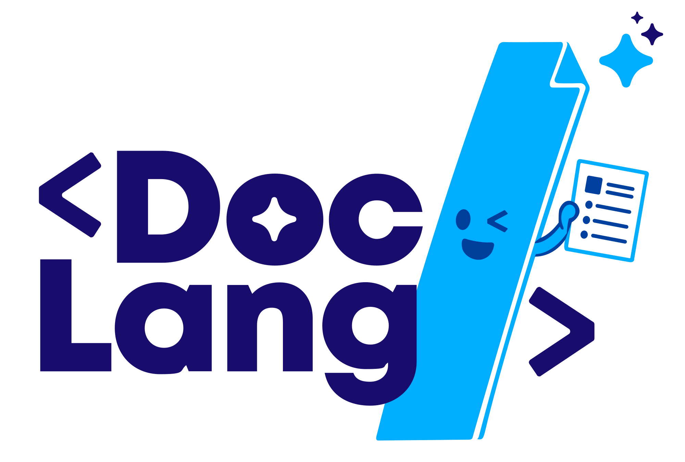

# Welcome to DocLang ISO format

**DocLang is the AI-native markup format for unstructured content — documents, images, audio, and video alike.** It is engineered from the ground up around a single principle: one DocLang token maps cleanly to one LLM token. That makes DocLang the most efficient way to read, write, and reason about real-world content with modern AI.

The world's knowledge lives in formats — PDF, HTML, Word, LaTeX, MP3, MP4 — that were designed for *rendering* or *playback*, not for *understanding*. The moment you hand them to an AI system, you lose structure, semantics, layout, timing, or all of them at once. And the formats AI does speak fluently fall short too: Markdown can't describe complex content, HTML wastes tokens, LaTeX is ambiguous, and none of them speak audio or video at all.

DocLang fixes this:

- **AI-native** — a controlled vocabulary that aligns 1-to-1 with LLM tokenizers, keeping prompts and outputs short and predictable
- **Lossless** — preserves structure, semantics, layout, and geometry in a single representation
- **Expressive** — first-class support for tables, formulas, code, charts, nested lists, forms, and multimodal content with visual grounding
- **Beyond documents** — extends naturally to audio and video, with native primitives for transcripts, speakers, timestamps, scenes, and audio-visual grounding — so an interview, a lecture recording, or a film script lives in the same representation as a PDF
- **Unambiguous** — every tag has one job, so the same content always serializes the same way
- **Open** — an ISO standard, developed in the open, governed by industry leaders

If you build with LLMs and VLMs on real-world content, DocLang is the substrate you've been missing.

### Scope

The DocLang standard specifies:

- The syntax and semantics of the DocLang markup language
- Rules for encoding document structure, content, and metadata
- Primitives for representing geometric layout and pagination
- Methods for expressing formatting and text direction
- Specifications for complex document components (tables, charts, formulas, code, forms)
- Requirements for conforming implementations

## Members

The founding members of the standard are:

1. IBM
2. ABBYY
3. RedHat
4. HumanSignal
5. Nvidia

We are open to accept invitations to join the DocLang governing team.

## LF AI & Data

DocLang ISO is hosted as a project in the [LF AI & Data Foundation](https://lfaidata.foundation/projects/).

## We ❤️ Open Source AI

We like to get continuous feedback from the community! We invent and develop in the fully in the open!